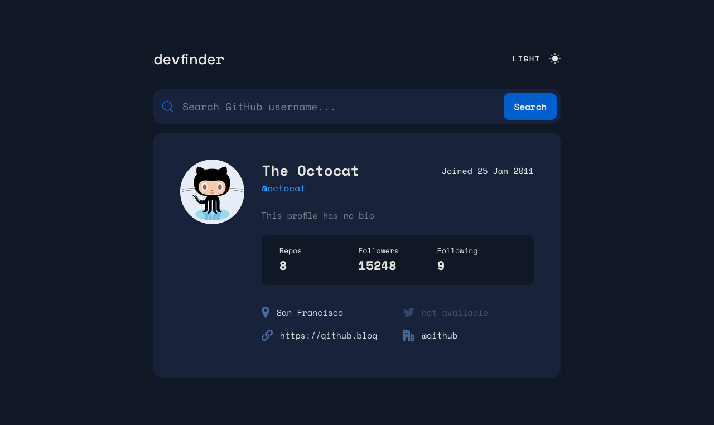

# GitHub User Search App with Suggestion List

## Table of contents

- [Overview](#overview)
  - [The challenge](#the-challenge)
  - [Screenshot](#screenshot)
  - [Links](#links)
- [My process](#my-process)
  - [Built with](#built-with)
  - [What I learned](#what-i-learned)
  - [Continued development](#continued-development)
  - [Useful resources](#useful-resources)
- [Author](#author)
- [Acknowledgments](#acknowledgments)

## Overview
This project is a GitHub User Search App designed to provide users with an intuitive interface for searching GitHub users by their username. Built with responsiveness and accessibility in mind, the app allows users to search for usernames, view a dropdown suggestion list, and see relevant user information—all while switching between light and dark themes based on user preferences.
Design from 
### The challenge

Users should be able to:

- **Responsive Design**: View the optimal layout for the app depending on their device's screen size
- **Hover State**: See hover states for all interactive elements on the page.
- **User Search**: Search for GitHub users by their username.
- **Dropdown Suggestions**: See a dropdown suggestion list as they type.
- **User Information**: See relevant user information based on their search
- **Theme Switching**: Switch between light and dark themes
- **Accessibility**: Navigate the app using keyboard accessibility features.

### Screenshot

### Links

- Solution URL: [GitHub Repo](https://github.com/Kellswork/github-user-search-app)
- Live Site URL: [Add live site URL here](https://your-live-site-url.com)

## My process

### Built with

- Semantic HTML5 markup
- CSS custom properties
- Flexbox
- CSS Grid
- Mobile-first workflow
- [React](https://reactjs.org/) - JS library
- [SCSS/SASS](https://sass-lang.com/) - For styles

### Key Takeaways

- **Effective State Management**: Deepened understanding of state management patterns and daa fetching patterns, particularly when handling asynchronous data from multiple sources.
- **User-Centric Design**: Emphasized the importance of an intuitive user interface, ensuring ease of use for diverse users.
- **Custom Hooks**: Developed custom hooks for efficient data fetching.
- **Theme Management**: Implemented dynamic theme switching based on user preferences.
- **Search Optimization**: Utilized debounce and deferred values to minimize unnecessary API calls, improving efficiency and responsiveness of the input search functionality.

### Useful Resources
- [Frontend-Mentor](https://www.frontendmentor.io/challenges/github-user-search-app-Q09YOgaH6) - A fantastic platform for honing front-end skills.
- [React Documentation](https://react.dev) - JS library - For understanding React fundamentals and advanced concepts.

## Author

Kelechi Ogbonna 
Passionate FulLStack(front-end heavy) dedicated to creating user-centric applications.

